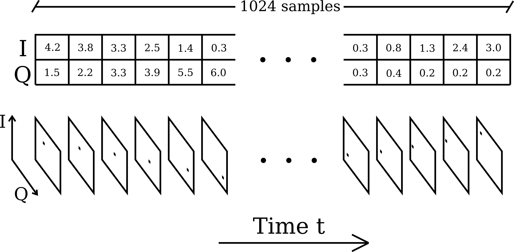

Abstract
========

Due to the growing need for communication services to share a limited
frequency spectrum, the ability to classify signals by modulation has
risen in importance. At the same time, the desirability of small,
low-cost communication devices means that efficiency of the solution is
almost as important as efficacy. With this in mind, our method leverages
spiking neural networks (an emerging event-based variant of traditional
neural networks) to perform modulation classification more efficiently
than previous approaches. We train a model using deep continuous local
learning, quantize the parameters, and validate our approach on the
RadioML dataset, a publicly available collection of I/Q radio signals.
Using this method, we achieve a peak accuracy of 56% with 955K network
parameters. We also propose a quantized model with 8-bit precision for
static parameters and 24-bit precision for runtime parameters, where the
quantization accounts for a drop in accuracy of around 1.5%. These
results represent a first step toward an efficient, event-driven
solution for signal classification.

Introduction
============

Radio communication plays an important role in modern-day life and
shapes the way people are able to communicate with each other through
mobile devices. A growing number of communication services (like the 5G
mobile phone network) need to share a very limited frequency spectrum.
The ability to share the same frequency range for different services is
thus very useful, but requires being able to classify and recognise
received radio signals by the service they belong to. To achieve this,
our project uses spiking neural networks in conjunction with the RadioML
dataset for training and evaluation.

The RadioML dataset is a publicly available dataset of radio signals of
24 different modulation classes and 26 different signal-to-noise ratios.
Different deep learning architectures have previously been used to
create models for classifying RadioML data and have achieved a
classification accuracy of up to 95% on data samples with high
signal-to-noise ratios (close to 30 dB).

Spiking neural networks are event-based neural networks based on
biological neurons. They receive input in form of discrete events
(spikes) which cause the internal neuron state to change (membrane
potential). Once the internal state of individual neurons reaches a
certain threshold, the neurons themselves cause further events (spikes)
to be forwarded to connected neurons.

While SNNs are considered relatively hardware-friendly and allow for
energy-efficient implementation on low-cost devices, they generally
achieve lower accuracy than regular neural networks (convolutional
networks, etc.) as per . Thus, when considering SNNs, and especially
when first seeing their associated classification accuracies, it is
important to keep in mind those aforementioned advantages – that they
can help produce lightweight, low-power and low-cost applications.

The goal for this project is to implement and optimize a spiking neural
network for modulation classification on the RadioML dataset and to
quantize the SNN in order to provide an efficient version that can be
implemented on an FPGA in the future.

For the quantization, we use a sofware package called Brevitas which
supports quantization-aware training of neural networks. We adapted
Brevitas to work together with the DCLL library for creating SNNs.

An overview of the used software parts is shown below:

<figure>
<figcaption>Overview of software parts for the project.</figcaption>
</figure>The contributions of our work are as follows:

-   We have made, to the best of our knowledge, the first attempt at
    applying spiking neural networks to the task of modulation
    classification for radio signals.

-   We have also optimized different parts of our model (state and
    weights) using quantization methods and adapted the DCLL library for
    compatibility with Brevitas.

-   Since our accuracy is still slightly below that of the
    worst-performing traditional networks from previous papers, the main
    advantage of our method is the fact that it is event-based and can
    be run more efficiently on specialized neuromorphic hardware.

Technical Material
==================

Spiking Neural Networks and DCLL
--------------------------------

A spiking neural network (SNN) is a variant of a neural network that
utilizes spike-based communication over continuous time in accordance
with actual biological neuron models. In this way, it can be seen as a
special case of a binary, recurrent neural network. However, while SNNs
use a more complex and powerful neuron model and are naturally equipped
to capture temporal dynamics, they suffer from very underdeveloped
training methods in relation to traditional neural networks. In
particular, they are difficult to train because spikes over time are
non-differentiable, and the biological neuron model decrees that
computation should remain local to each neuron, meaning we cannot simply
backpropagate through time (backpropagation through time tends to be
prohibitively expensive with regard to memory anyway).

Fortunately, one recent paper () provides a convenient way to implement
and train spiking neural networks using local layer-wise gradients which
are only backpropagated within the same layer and time step. Their
method is called “deep continous local learning," or DCLL for short. In
DCLL, each layer is itself trained to solve the classification task
(although the spiking output is still passed to the next layer), in that
a frozen fully-connected reduction of the layer output is optimized to
predict the correct class probabilities. This ensures that each layer
learns useful features for solving the relevant task.

In the DCLL formulation of a spiking neural network, each neuron
maintains extra state variables that are propagated forward in time.
Because this information is sufficient for computing gradients at the
next time step, DCLL allows for memory-efficient training.

As per and the associated public codebase, the dynamics of the spiking
neural network under DCLL can be described by the following equations:
$$\\begin{aligned}
    Q^l(t + \\Delta t) &= \\beta Q^l(t) + \\frac{1}{1 - \\beta}S^{l-1}(t) \\\\
    P^l(t + \\Delta t) &= \\alpha P^l(t) + \\frac{1}{1 - \\alpha}Q^l(t) \\\\
    R^l(t + \\Delta t) &= \\gamma R^l(t) - (1 - \\gamma) S^l(t) \\\\
    U^l(t + \\Delta t) &= \\texttt{conv}(P^l(t + \\Delta t)) + R^l(t + \\Delta t) \\\\
    S^l(t + \\Delta t) &= 1 \\text{ if } U^l(t + \\Delta t) \\geq 0 \\text{ else } 0\\end{aligned}$$
where *l* denotes the layer, *t* denotes the time step,
*S**l* is the output spike image for layer *l*, and
*P*, *Q*, *R*, *U* are synaptic, refractory, and membrane-related state
variables. *Δ**t* denotes the length of the time step. Note that the
values of *P**l*, *Q**l*, *R**l*, and
*S**l* are each passed to the next time step in the same
layer, so these variables encapsulate the “state" of a neuron in a
layer. One important point is that although these state variables are
passed to the next time step, their gradients neither need nor will be
allowed to propagate backward through time (resulting in a critical
savings in memory, as we do not need to keep track of the entire
computation graph for multiple time steps).

<figure>
<figcaption>Simplified view of a convolutional DCLL spiking layer.</figcaption>
</figure>\[fig:snn\_neuron\]

RadioML
-------

We train and evaluate our method on radio signals from the RadioML
dataset. This dataset consists of 2.5 million radio signals formatted as
I/Q samples over 1024 time steps each. Each signal is labeled with its
modulation class (one of 24) and SNR (one of 26, with the minimum SNR
being -20 dB and the maximum SNR being +30 dB). Following , we only
train on SNRs from +6 dB to +30 dB.

Although previous deep learning approaches have typically fed the entire
1024-length signal to the network at once (as a 1D signal with two
channels), we would like to provide our spiking neural network with a
spiking input for each time step. Therefore, we transform each I/Q
sample (a tuple of two numbers representing the real and imaginary
components of the signal at a time step) into an image by plotting the
I/Q sample on the I/Q plane and discretizing the plane over the range
\[ − 1, 1\] in each dimension. This way, one could imagine each data
point in the signal arriving one after another (as events) to the SNN,
which would provide class predictions in real time.

<figure>
<figcaption>A visualization of image discretizations for I/Q samples.</figcaption>
</figure>\[fig:radioml\_iq\_images\]

Brevitas
--------

Brevitas is a machine learning library based on PyTorch for
quantization-aware training. While conservative quantization (keeping
the bit-width relatively high) may be possible retrospectively after the
training process without too much loss of accuracy, quantization for
very low bit-width (e.g. 2- and 4-bit) can often achieve better results
if the model is trained using the quantized forward pass. Brevitas
assists with adjusting PyTorch models and optimizing them for use in
scenarios which require quantization.

For this purpose, Brevitas defines various classes that can be used
similarly to the conventional PyTorch classes, e.g. `QuantConv2D` and
`QuantLinear`. Each of these classes support detailed settings to
specify the nature of the quantization, e.g. the minimum and maximum
bit-width, the method of converting numbers to integers and scaling
factor, and whether or not rescaling will be applied.

Brevitas defines a `QuantTensor` which is used as the quantized version
of a regular `Tensor` in PyTorch. It is implemented as a named tuple
containing three values: the actual tensor, the scale factor, and the
bit width. The actual tensor corresponds to the regular PyTorch tensor
object. The values in this tensor are still floating point numbers, but
they will only be set to values that correspond to the correct quantized
grid—essentially this tensor contains the integer values multiplied by
the scale factor. The second tensor in the tuple contains only one
element which is the scale factor that was applied to the integer
values, and the third tensor contains the bit width that was used for
the `QuantTensor` – for example if the bit width is 2, there are only
four values allowed in total in the first tensor. The scale factor
determines which values are allowed.

Tuning of SNN for RadioML network
---------------------------------

We tried a lot of different hyperparameter settings in order to train
the SNN on RadioML data. Dimensions that we varied included, among other
things: the resolution of the discretized I/Q images, the ranges of the
dicsretized I/Q images, the regularization weights, the network
architecture (number of filters in each layer, severity of pooling,
kernel sizes, different padding sizes and types, number of convolutional
layers, number of dense layers, spiking versus non-spiking dense
layers), the constants for the spiking neuron dynamics, the activation
functions, dropout probabilities, additional dropout layers, different
sampling weights for different classes and SNRs, different SNRs used for
training, different subsamplings of the data, continuing the training of
pre-trained networks with different settings, different data
preprocessing (e.g. wider spikes, “gamma correction" for different and
nonlinear discretizations of the \[-1, 1\] range in order to put more
pixels in the parts of the range where there were more samples,
difference images – including an extra event for spikes being removed
from the previous time step), increased burn-in times (where training
updates don’t happen), different fixed signal durations during training,
randomized burn-in and start times and signal durations during training,
random noise injection, and learning rates (including different learning
rates for each layer).

Proposed Architecture and Results
---------------------------------

Ultimately, our best-performing architecture ended up containing three
convolutional layers with 32 learned 7 × 7 kernels in each layer (and
length-3 zero padding on each side), followed by a fully-connected layer
and a softmax activation to reduce the intermediate results to class
probabilities. Each layer was, of course, a spiking DCLL layer wrapped
around these base layer types.

<figure>
<figcaption>High-level overview of network architecture.</figcaption>
</figure>\[fig:network\_arch\]

Although we spent a lot of time tuning hyperparameters for the SNN, we
found it difficult to move past mid-50% classification accuracies on the
test set. For full 24-class classification, the peak per-SNR accuracy of
our SNN model was 56%.

<figure>
<figcaption>Per-layer classification accuracies at different SNRs.</figcaption>
</figure>\[fig:snr\_results\]

Adapting DCLL for Brevitas
--------------------------

### Static Parameters

To quantize the weights of the spiking neural network, we extended the
`Conv2dDCLLlayer` class to a new class `QuantConv2dDCLLlayer`. This is
similar to the way the `QuantConv2D` layer is built on top of `Conv2D`
in the Brevitas library.

The `QuantConv2dDCLLlayer` uses the same weight tensor `self.weight` to
store the precise floating point weights during the training process.
However, the forward pass is modified so that the precise weights are
quantized to a fixed integer bit width before being used to process the
input. Similarly to the implementation of `QuantConv2D`, we used a
`WeightQuantProxy` object for the purpose of quantizing the weights.
Throughout the training process, Brevitas will maintain one single scale
factor per layer which is applied to the integer values of the quantized
weights and is rescaled automatically during the training process to
allow the weights to make best use of the available bit width.

### Runtime Parameters

In SNNs it is important to keep track of the internal neuron state
(membrane potential) throughout time. The next state value is calculated
from a function of input, weights, and previous state. To quantize the
state variables, it doesn’t make sense to use dynamic scaling during the
training process (as was used for weight quantization) since the state
constantly changes during runtime and we need a permanent scale value
for the device that the SNN is going to be run on.

To determine such a scale factor, the expected range has been measured
experimentally by applying the test set on the network and storing
maximum and minimum state value throughout computation. A
`QuantIdentity` function is then used in Brevitas to fit integer
variables of a certain bit width into an interval of real numbers
(between 0 and the maximum value of the state determined experimentally,
plus an added safety interval to allow the state higher values then the
highest value measured in experiments). The Brevitas `QuantIdentity`
function will, given the maximum value, automatically determine the
scale factor applied to the raw integer values in order to get the state
value adjusted to the desired range.

This is implemented as separate class `QuantContinuousConv2DState` which
is a built on top of and as a replacement for `QuantContinuousConv2D`.
While the latter class only supports weight quantization, the former can
be used for both state and weight quantization.

Evaluating Quantized SNN for RadioML
------------------------------------

We evaluated the quantized model on different bit widths to see how the
reduced number precision would impact the overall model performance.
Interestingly, the model is relatively tolerant to weight quantization.
Even aggressive quantization of the model weights to 2-bit integers does
not lead to a drop in accuracy of more than -5%.

The internal neuron state is much more sensitive to lower precisions.
Quantizing the state variables to 12-bit integers already causes the
accuracy to be halved compared to the non-quantized model.

<figure>
<embed src="quantized_weight.pdf" style="width:50.0%" /><figcaption>Model accuracy for quantized weights.</figcaption>
</figure>\[fig:quantized\_weights\_result\]

<figure>
<embed src="quantized_state.pdf" style="width:50.0%" /><figcaption>Model accuracy for quantized state.</figcaption>
</figure>\[fig:quantized\_state\_result\]

Proposed Quantized Architecture and Results
-------------------------------------------

Based on the evaluation results, we chose a weight quantization of 8-bit
and a state quantization of 24-bit. This leads to a memory reduction for
weights by 75% for the neuron state of 25% compared to a model using
floating point parameters, while reducing the classification accuracy on
the dataset by 1.37%.

The following image is an illustration of a quantized DCLL layer. The
network in total again consists of three convolutional DCLL layers
followed by a fully-connected layer (non-spiking) which connects to the
membrane potential of the neurons of the last layer.

<figure>
<figcaption>Architecture of quantized layer.</figcaption>
</figure>Conclusion
==========

In this project, we conducted, to our knowledge, the first foray into
using spiking neural networks for automatic modulation classification on
RadioML. We integrated DCLL SNNs, RadioML, and Brevitas into a
multi-component system capable of classifying radio signals using
quantized spiking neural networks.

Unfortunately, our results remained rather subpar in comparison to
state-of-the-art traditional networks, despite all of our efforts to
tune things for the better. We suspect that this may be due to the
limitations of the training method that we are using for spiking
networks, or the subpar regularization that we are applying (as the
network does much better on the training set than it does on the test
set).

Nevertheless, as spiking neural networks and event-based communication
grow as a field of interest for the AI/ML community (for example,
event-based cameras are gaining traction in computational photography,
meaning visual domains may soon have a greater use for spiking-type
networks), new training methods will be developed that may help close
the gap between SNNs and residual networks on modulation classification.
Furthermore, we consider it a promising sign that our network is able to
achieve near-perfect accuracy on the training dataset, showing that it
likely possesses the necessary representational capacity to solve the
problem and simply needs to be regularized in some better and
potentially SNN-specific way.

Finally, one (motivating) advantage that SNNs have over their
traditional counterparts is efficiency; with the adoption of specialized
and increasingly prevalent neuromorphic hardware, SNNs can be made to
only process the “events" and thus operate much more efficiently than
most previous methods. Over time, as new methods drive the accuracy for
SNN-based 24-modulation classification upward from our best result of
56%, SNNs will likely become increasingly attractive as the accuracy gap
lessens and the efficacy-efficiency tradeoff shifts in favor of SNNs on
neuromorphic hardware.

Milestones
==========

In this section we include the original schedule for the project
including the proposed milestones and address progress made throughout
the project and how the milestones were completed.

Broadly, we were able to tackle every milestone,

\[sec:schedule\]

<table>
<caption>Summary of milestone/deliverable schedule</caption>
<thead>
<tr class="header">
<th style="text-align: left;"><strong>Week</strong></th>
<th style="text-align: left;"><strong>Type</strong></th>
<th style="text-align: left;"><strong>Description</strong></th>
<th style="text-align: left;"><strong></strong></th>
</tr>
</thead>
<tbody>
<tr class="odd">
<td style="text-align: left;">4</td>
<td style="text-align: left;">Milestone</td>
<td style="text-align: left;">Train SNN (DCLL lib) with MNIST dataset</td>
<td style="text-align: left;">Simon</td>
</tr>
<tr class="even">
<td style="text-align: left;"></td>
<td style="text-align: left;">Milestone</td>
<td style="text-align: left;">Preprocess and load RadioML dataset for SNN</td>
<td style="text-align: left;">Owen</td>
</tr>
<tr class="odd">
<td style="text-align: left;">5</td>
<td style="text-align: left;">Milestone</td>
<td style="text-align: left;">Get familiar with Brevitas library</td>
<td style="text-align: left;">Simon</td>
</tr>
<tr class="even">
<td style="text-align: left;"></td>
<td style="text-align: left;">Milestone</td>
<td style="text-align: left;">Get familiar with the DCLL codebase</td>
<td style="text-align: left;">Owen</td>
</tr>
<tr class="odd">
<td style="text-align: left;">6</td>
<td style="text-align: left;">Milestone</td>
<td style="text-align: left;">Extend Brevitas for usage with SNNs from dcll library</td>
<td style="text-align: left;">Simon</td>
</tr>
<tr class="even">
<td style="text-align: left;"></td>
<td style="text-align: left;">Milestone</td>
<td style="text-align: left;">Adapt SNN for RadioML using DCLL PyTorch library</td>
<td style="text-align: left;">Owen</td>
</tr>
<tr class="odd">
<td style="text-align: left;">7</td>
<td style="text-align: left;">Deliverable</td>
<td style="text-align: left;">Hyperparameter tuning of SNN for RadioML</td>
<td style="text-align: left;">Simon</td>
</tr>
<tr class="even">
<td style="text-align: left;"></td>
<td style="text-align: left;">Deliverable</td>
<td style="text-align: left;">Hyperparameter tuning of SNN for RadioML</td>
<td style="text-align: left;">Owen</td>
</tr>
<tr class="odd">
<td style="text-align: left;">8</td>
<td style="text-align: left;">Milestone</td>
<td style="text-align: left;">Adapt RadioML SNN for quantization in Brevitas</td>
<td style="text-align: left;">Simon</td>
</tr>
<tr class="even">
<td style="text-align: left;"></td>
<td style="text-align: left;">Milestone</td>
<td style="text-align: left;">Tuning of architecture parameters for RadioML SNN</td>
<td style="text-align: left;">Owen</td>
</tr>
<tr class="odd">
<td style="text-align: left;">9</td>
<td style="text-align: left;">Deliverable</td>
<td style="text-align: left;">Optimize quantized version of RadioML SNN</td>
<td style="text-align: left;">Simon</td>
</tr>
<tr class="even">
<td style="text-align: left;"></td>
<td style="text-align: left;">Deliverable</td>
<td style="text-align: left;">Optimize quantized version of RadioML SNN</td>
<td style="text-align: left;">Owen</td>
</tr>
<tr class="odd">
<td style="text-align: left;">10</td>
<td style="text-align: left;">Deliverable</td>
<td style="text-align: left;">Final report and video (focus: quantization)</td>
<td style="text-align: left;">Simon</td>
</tr>
<tr class="even">
<td style="text-align: left;"></td>
<td style="text-align: left;">Deliverable</td>
<td style="text-align: left;">Final report and video (focus: SNN implementation)</td>
<td style="text-align: left;">Owen</td>
</tr>
</tbody>
</table>

\[milestone\_summary\]

Week 4
======

**Simon**:

<table>
<tbody>
<tr class="odd">
<td style="text-align: left;">:</td>
<td style="text-align: left;">Train SNN (DCLL lib) with MNIST dataset.</td>
</tr>
<tr class="even">
<td style="text-align: left;">:</td>
<td style="text-align: left;">Have an SNN network that can be run on the MNIST dataset on the GPU cluster.</td>
</tr>
<tr class="odd">
<td style="text-align: left;">:</td>
<td style="text-align: left;"></td>
</tr>
</tbody>
</table>

-   Configured job on GPU cluster to work with DCLL library

    -   Issue faced: Allocate RAM to allow training process to proceed
        properly without crashing while keeping utilization high

-   Trained the default MNIST SNN on the cluster, peak accuracy: 99.02%

    <figure>
    <embed src="mnist_original.pdf" style="width:50.0%" /><figcaption>Accuracy throughout training process for default MNIST model</figcaption>
    </figure>

**Owen**:

<table>
<tbody>
<tr class="odd">
<td style="text-align: left;">:</td>
<td style="text-align: left;">Preprocess and load RadioML dataset for SNN.</td>
</tr>
<tr class="even">
<td style="text-align: left;">:</td>
<td style="text-align: left;">Have the RadioML data on the GPU cluster in a form that can be fed to the SNN.</td>
</tr>
<tr class="odd">
<td style="text-align: left;">:</td>
<td style="text-align: left;"></td>
</tr>
</tbody>
</table>

See the code on GitHub (along with the file histories) which will show
that a version of RadioML loading and preprocessing was implemented in
Week 4, and a better version is implemented now.

Currently, we split the RadioML data into (per-class, per-SNR) HDF5
files, load the data from there, and convert the time-series data into
spike trains by transforming the signal input at each time step into a
spike at the nearest binned spatial location on the I/Q plane. The
relevant files are
[data/load\_radio\_ml.py](https://github.com/ohjay/snn-modulation-classification/blob/master/data/load_radio_ml.py)
(note: the previous text is a link), which does the initial HDF5
loading, and
[data/utils.py](https://github.com/ohjay/snn-modulation-classification/blob/master/data/utils.py),
which performs the conversion to spike trains.

Week 5
======

**Simon**:

<table>
<tbody>
<tr class="odd">
<td style="text-align: left;">:</td>
<td style="text-align: left;">Get familiar with Brevitas library.</td>
</tr>
<tr class="even">
<td style="text-align: left;">:</td>
<td style="text-align: left;">Written report including a description of which functionality Brevitas offers, how the codebase of Brevitas is organized, how it is used for regular neural networks and outline on where extensions for spiking neural networks will have to be made.</td>
</tr>
<tr class="odd">
<td style="text-align: left;"></td>
<td style="text-align: left;"></td>
</tr>
</tbody>
</table>

Refer to the description of Brevitas in section
<a href="#sec:brevitas" data-reference-type="ref" data-reference="sec:brevitas">3.3</a>.

Important parts of the Brevitas code for this project are located in the
following directories:

-   **nn:** Defines higher level classes
    like convolutional and linear layers, activation function, batch
    normalisations with quantization support

-   **proxy:** Useful quite high-level
    structures for quantization e.g. to track weights and perform scaled
    quantization

-   **core:** Contains the low-level
    part of Brevitas defining a TensorQuant structure and IntQuant
    classes that can e.g. quantize floating point values into the
    correct integer range given certain bit settings and a scale factor

For the weight quantization, we will look at the implementation for the
already provided `QuantConv2D`, a regular convolutional layer that
builds upon `Conv2D` and takes the precise weights of the `Conv2D` part
and quantizes them during every forward pass. The implementation for the
DCLL convolutional layer will work in similar fashion using the
`WeightQuantProxy` object.

**Owen**:

<table>
<tbody>
<tr class="odd">
<td style="text-align: left;">:</td>
<td style="text-align: left;">Get familiar with the DCLL codebase, determine which parts of the code will need to be changed in order to create a VGG-like SNN architecture using DCLL modules.</td>
</tr>
<tr class="even">
<td style="text-align: left;">:</td>
<td style="text-align: left;">Written report which includes a high-level overview of the different parts of the code and a description of which specific files and functions will need to be changed or utilized in order to define a VGG-like architecture for use with RadioML.</td>
</tr>
<tr class="odd">
<td style="text-align: left;">:</td>
<td style="text-align: left;"></td>
</tr>
</tbody>
</table>

Following is a written report, which could be expanded to a separate
page upon request. After the refactor/cleanup, the code is split into
four different folders: data, dcll, networks, and scripts. data includes
files that relate to the loading of specific datasets (currently the
supported options are MNIST and RadioML) and preprocessing them –
converting them to spike trains, for example. dcll includes files
(largely unedited from those of the original authors) which implement
the Deep Continuous Local Learning layers and define auxiliary
experimental utilities. networks includes a Python file which implements
general architecture-building, and YAML files that specify, in a
readable format, the architectures we use for our specific use cases
(MNIST and RadioML classification). scripts contains runnable training
and testing scripts for MNIST and RadioML. Finally, in the root
directory, there is the train.py file which serves as an entry point for
training. It sets things up according to command-line arguments and then
runs a training/evaluation loop.

In order to define a VGG-like architecture for use with RadioML, we will
need to change the YAML network specification in
networks/radio\_ml\_conv.yaml. And that should be it, since the code has
been refactored to support generalized YAML-based network building. For
hyperparameter tuning, the hope is that we will mainly just need to
modify the command-line arguments in the launch scripts.

Week 6
======

**Simon**:

<table>
<tbody>
<tr class="odd">
<td style="text-align: left;">:</td>
<td style="text-align: left;">Extend Brevitas for usage with spiking neural networks from dcll library.</td>
</tr>
<tr class="even">
<td style="text-align: left;">:</td>
<td style="text-align: left;">Have a trained quantized version of the MNIST network for different bit sizes (16-, 8- and 4-bit) and report on accuracy achieved.</td>
</tr>
<tr class="odd">
<td style="text-align: left;">:</td>
<td style="text-align: left;"></td>
</tr>
</tbody>
</table>

The changes made to combine DCLL library code with the Brevitas
framework is described in section
<a href="#sec:dcll_brevitas" data-reference-type="ref" data-reference="sec:dcll_brevitas">3.6</a>
of this report.

The weight quantization for the MNIST model achieved the following
results:

<figure>
<embed src="mnist_quantization.pdf" style="width:50.0%" /><figcaption>Accuracy for MNIST SNN with quantized weights</figcaption>
</figure>A summary of the results achieved using runtime quantization is
shown below:

<embed src="eps0.pdf" title="fig:" style="width:40.0%" /> 
<embed src="eps1.pdf" title="fig:" style="width:40.0%" />

**Owen**:

<table>
<tbody>
<tr class="odd">
<td style="text-align: left;">:</td>
<td style="text-align: left;">Adapt SNN for RadioML using DCLL PyTorch library.</td>
</tr>
<tr class="even">
<td style="text-align: left;">:</td>
<td style="text-align: left;">Have a first SNN modeled after VGG that can be trained on RadioML data (ignoring actual performance at this point).</td>
</tr>
<tr class="odd">
<td style="text-align: left;">:</td>
<td style="text-align: left;">By checking the history of <a href="https://github.com/ohjay/snn-modulation-classification/blob/master/networks/radio_ml_conv.yaml">networks/radio_ml_conv.yaml</a> (the previous text is a link), you can see the specifications for the VGG-inspired networks that we set up. Furthermore, you can browse the different states of the codebase over the last few weeks, where we were able to train an SNN on RadioML data in almost all of them (pretty much every commit after week 4 should support SNN RadioML training – just run scripts/train_radio_ml.sh at any point in the history where the script exists).</td>
</tr>
</tbody>
</table>

 
 

Week 7 - Deliverable
====================

**Owen & Simon**:

<table>
<tbody>
<tr class="odd">
<td style="text-align: left;">:</td>
<td style="text-align: left;">Hyperparameter tuning of SNN for RadioML</td>
</tr>
<tr class="even">
<td style="text-align: left;"></td>
<td style="text-align: left;">Explore different versions for hyperparameters focusing on learning rate, learning rate decay schedule, optimizers, momentum, batch size, etc. to optimize achieved accuracy of the network.</td>
</tr>
<tr class="odd">
<td style="text-align: left;">:</td>
<td style="text-align: left;">Classify RadioML data by modulation with at least, say, 60% accuracy on the test set (which corresponds to the worst performance reported in the previous work).</td>
</tr>
<tr class="even">
<td style="text-align: left;">:</td>
<td style="text-align: left;">Report on architecture, implementation and hyperparameters for the model and discuss resulting accuracy.</td>
</tr>
<tr class="odd">
<td style="text-align: left;"></td>
<td style="text-align: left;">For results of the optimization process, refer to “Tuning of SNN for RadioML network" section of the report.</td>
</tr>
</tbody>
</table>

Week 8
======

**Simon**:

<table>
<tbody>
<tr class="odd">
<td style="text-align: left;">:</td>
<td style="text-align: left;">Adapt RadioML SNN for quantization in Brevitas.</td>
</tr>
<tr class="even">
<td style="text-align: left;">:</td>
<td style="text-align: left;">Have a trained quantized version of RadioML SNN in Brevitas (without focusing on accuracy at this point).</td>
</tr>
<tr class="odd">
<td style="text-align: left;">:</td>
<td style="text-align: left;"></td>
</tr>
</tbody>
</table>

For this milestone, the SNN for RadioML from week 7 was adjusted to work
with classes `QuantConvNetwork`, `QuantConv2dDCLLlayer`. Training of
quantized weights worked without any further problems. For the state
quantization, the accuracy initially dropped significantly. This was due
to the maximum state value being poorly calibrated for the new type of
data. After determining the new maximum value and readjusting the
quantized state variable, the drop in accuracy was comparable to the
experiments run on MNIST data in week 6. **Owen**:

<table>
<tbody>
<tr class="odd">
<td style="text-align: left;">:</td>
<td style="text-align: left;">Tuning of architecture parameters for RadioML SNN</td>
</tr>
<tr class="even">
<td style="text-align: left;"></td>
<td style="text-align: left;">Hyperparameter tuning can be a very time-consuming and tedious process. Therefore, we schedule this week to continue experimentation, focusing on modifications and optimizations of the model architecture.</td>
</tr>
<tr class="odd">
<td style="text-align: left;">:</td>
<td style="text-align: left;">Have optimized RadioML SNN with highest achieved accuracy, update report with results.</td>
</tr>
<tr class="even">
<td style="text-align: left;">:</td>
<td style="text-align: left;"></td>
</tr>
</tbody>
</table>

We did continue to tune hyperparameters and re-train networks throughout
these weeks (for more details, see “Tuning of SNN for RadioML network"
in the Technical Material section of this report). However, despite our
best efforts, the gains in accuracy were marginal, going from around 49%
to 54%.

Week 9 - Deliverable
====================

**Owen & Simon**:

<table>
<tbody>
<tr class="odd">
<td style="text-align: left;">:</td>
<td style="text-align: left;">Optimize quantized version of RadioML SNN.</td>
</tr>
<tr class="even">
<td style="text-align: left;"></td>
<td style="text-align: left;">Experiment with the Brevitas model for RadioML to reduce model size while maintaining high accuracy.</td>
</tr>
<tr class="odd">
<td style="text-align: left;">:</td>
<td style="text-align: left;">Have optimized quantized RadioML SNN with highest achieved accuracy.</td>
</tr>
<tr class="even">
<td style="text-align: left;">:</td>
<td style="text-align: left;">Report on architecture, implementation and hyperparameters for quantized RadioML SNN.</td>
</tr>
<tr class="odd">
<td style="text-align: left;">:</td>
<td style="text-align: left;"></td>
</tr>
</tbody>
</table>

The network was trained and evaluated using different bit widths for
weights and neuron state to optimize the performance and find a
trade-off between accuracy and resource consumption of the network.

<embed src="quantized_weight.pdf" title="fig:" /> 
<embed src="quantized_state.pdf" title="fig:" />

For the proposed network we chose a weight quantization of 8-bit and a
state quantization of 24-bit. This leads to a memory reduction for
weights by 75% for the neuron state of 25% compared to a model using
floating point parameters while reducing the classification accuracy on
the dataset by 1.37%.

Week 10 - Deliverable
=====================

**Owen & Simon**:

<table>
<tbody>
<tr class="odd">
<td style="text-align: left;">:</td>
<td style="text-align: left;">Final report and video</td>
</tr>
<tr class="even">
<td style="text-align: left;">:</td>
<td style="text-align: left;">Submit final report and video addressing project progress, challenges, solutions and results.</td>
</tr>
<tr class="odd">
<td style="text-align: left;">:</td>
<td style="text-align: left;">Final report submitted and video introduction to the project uploaded to Youtube. Video and documentation can be found on the project webpage <a href="https://iot-lif.github.io/">https://iot-lif.github.io/</a>.</td>
</tr>
</tbody>
</table>
